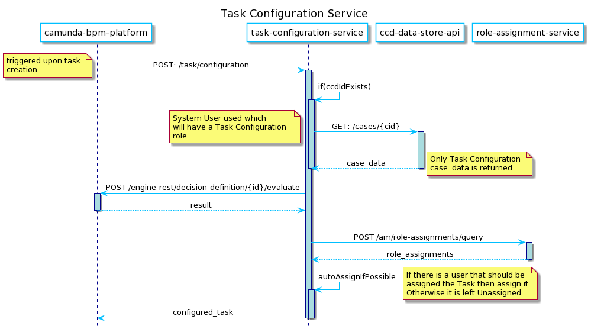

# wa-task-configuration-api

[](https://travis-ci.org/hmcts/wa-task-configuration-api)

#### What does this app do?

- Receives an unconfigured Task upon its creation
- Retrieves CCD case data for given caseId
- Evaluates DMN configuration and gets output variables
- Updates the Task
- Auto-assigns the Task
- Responds with a Configured Camunda Task.

<!--
    Sequence Diagram Source:
    http://www.plantuml.com/plantuml/uml/fLFFR-is33vNVmNnTjaEVZwlXuUN_jXGe4CBf3qNZ4JRQcJ9fQYaGTl_VPRZf4sG9HlcaqH-_FY9_Fmp2hAargd66e8g19c5LwNYtFeE6Lk83PgmjBu6uKGx6Nf9v3N1cpgRC8VbPN21uOgecyvN5ovH7zSI-2Am8Lvd3V9yDgHkRKMtrjE9BEfvpI5viqRyCldzwlBg3tMcpkwHnMhRePUHOx__3cQVQTbO8GNZznV5Y3LDdAqzQF92h3wK4YkEu07Z72w3hsoT6CK63rFYXTMa52O9gCKkK0Y2LzrdH_YciUtxOJ7hsg9pA5NWzjikH7hkGd_bBkAQUm-ejIaC2XPH0bE1dTq3S71zE4PR-vQyR6a08p16fTHXFSMFOoBW7ExlfW_dK6PGkGCQfkU343YgP9obiArhOZAGkk0XLy6OqaoVTUJDK9jr7Ub_KfsjVjNQt9ZhLnib_dQ23eeVXqQPYVwypg_K66aPU4uSoxTapKVvdDX6OtNcwMFFEPPHXQmwwWDQDf5ywSy7np9THQ4M7YCnf4Wc-qytcyaihNFGu8803xbj0yih_huxlI5CajX3bl2KtwMKeOqdZpjigvHjtMoatdctEgHYJ6_RW8rZQp8xeavjzB0FHwT1QKZRc2iCLTRRN5o-vHdJ0br28JK-c2ac9qgzlx-VQWcCSTi0stBlPudbIo9UgOmgUlGnidF8nKzVYl-dWp59c0niDzLzw0ypHuStSrE1DCIK9u_PHjpVKI0s8Ja3CnfnQsraCdhOP3xuCGnsk-XCjhIH-b2cp7Q5Hx-f_luVbZfCxH_tkgaXyvGv1jv_Qz6Vv4rgtTy0

    See: https://plantuml.com/ docs for reference
-->




## Notes

Since Spring Boot 2.1 bean overriding is disabled. If you want to enable it you will need to set `spring.main.allow-bean-definition-overriding` to `true`.

JUnit 5 is now enabled by default in the project. Please refrain from using JUnit4 and use the next generation

## Building and deploying the application

### Building the application

The project uses [Gradle](https://gradle.org) as a build tool. It already contains
`./gradlew` wrapper script, so there's no need to install gradle.

To build the project execute the following command:

```bash
  ./gradlew build
```
This will do compilation, checkstyle, PMD checks , run tests , but not integration or functional tests.

### Running the application

- Prerequisite:
    - Install yarn
    ```
        yarn upgrade --latest
    ```
    - git clone git@github.com:hmcts/ia-ccd-definitions.git
    - change folder cd ia-ccd-definitions
    - Install needed yarn libs
        ```
            yarn install
        ```
    - Setup local repo for ccd-definition-processor
        ```
            yarn setup
        ```
    - Upload case definitions
        ```
            yarn upload-wa
        ```
- To run application, from IDE or command line
   ```
     ./gradlew bootRun
   ```
- In order to test if the application is up, you can call its health endpoint:
   ```
     http://localhost:8091/health
   ```

  You should get a response similar to this:

  ```
    {"status":"UP","diskSpace":{"status":"UP","total":249644974080,"free":137188298752,"threshold":10485760}}
  ```

- To run FT locally
    - Run ia-case-api
       ```
         ./gradlew bootRun
       ```
    - Run ia-case-notifications
       ```
         ./gradlew bootRun
       ```
    - Run ia-case-documents-api
       ```
         ./gradlew bootRun
       ```
    Note: If you see any environment variables missing, do source ~/.bash_profile.
          Make sure you have got the environment variables in bash_profile.

     - To run all tests including junit, integration and functional. You can run the command
        ```
            ./gradlew test integration functional
        ```
       or
        ```
            ./gradlew tests
        ```

## License

This project is licensed under the MIT License - see the [LICENSE](LICENSE) file for details
